# Segment Tree

# Summary
The goal of this project was to implement a Segment Tree that tracks the best team across a range of matches, updating dynamically as results change which is a common need in live eSports or sports tracking applications.

Instead of focusing on raw performance optimizations, I prioritized clarity, simplicity, and correctness, especially for educational and development purposes:
- Rebuilding the tree after updates guarantees consistency without introducing complex logic.
- Alphabetical tie-breaking keeps comparisons straightforward when multiple teams have the same number of wins.
- Exact name matching avoids the need for fuzzy logic and keeps team identification unambiguous.

I implemented the Segment Tree using a vector-based recursive structure, where each node stores:
- A count of wins per team in its range.
- The team with the most wins in that range.
- Tie resolution logic that ensures consistent behavior.

While this approach might use more memory and require rebuilding more often than strictly necessary, it results in clean, bug-free behavior and makes the logic easier to
follow which was ideal for building a working version of the Segment Tree and focusing on learning how it functions.

# Full Explaination
For this project, I implemented a node-based Segment Tree data structure in C++. Conceptually, a Segment Tree resembles a Binary Search Tree (as studied in CPBS 2270), but instead of organizing nodes by key values, it partitions index ranges. It stores aggregated information about intervals of an array, and is constructed using a divide-and-conquer strategy: the index range is repeatedly split in half until each node corresponds to a single element. For instance, an array a[0 ... n-1] is split into [0 ... mid] and [mid+1 ... n-1] segments, recursively, until segments cover exactly one index. Each internal node then stores aggregate data for its range—such as a sum, minimum, maximum, or in this case, the “best team” based on match results within that segment.

This implementation applies the Segment Tree concept to an eSports-style example, tracking the top-performing team over a range of matches. The data is stored in three main vectors. The vectors are teams for team names, wins for total wins per team across all matches, and winnerIdx for the index of the team that won each match. Each node of the tree stores:

counts: A vector sized exactly to teams.size() that records how many wins each team has within that node’s range.

bestCount and bestTeamIdx: Precomputed values representing the number of wins and index of the top-performing team in that range, so queries can return results without rescanning the entire counts vector. In cases where two teams have the same number of wins, the tie is broken alphabetically by team name—but only if both teams have at least one win within that range.

The build() method constructs the tree using the provided teams list and winnerIdx match history. Each node represents a range of match indices [start, end], with the left child covering [start, mid] and the right child covering [mid+1, end]. At a leaf node, where start == end, the node corresponds to a single match, and its counts vector records one win for the winner of that match. Internal nodes aggregate their children’s data by summing the per-team wins, then determine the best team in that range by comparing bestCount values and applying the alphabetical tie-break rule. This approach ensures every node maintains a consistent view of the “best team” for its segment of matches.

The data structure can be updated through several methods:

addMatchByName(): Logs a new match winner in both winnerIdx and wins, then rebuilds the tree so queries reflect the updated data.
addTeam(): Appends a new team with an initial win total, then rebuilds the tree so all nodes’ counts vectors resize to match the updated teams.size().
removeTeam(): Removes a team from teams and wins, iterates through winnerIdx to mark any matches won by that team as -1, decrements indices for teams above the removed team, and rebuilds the tree.

After any operation that changes the number of teams or alters match history (addTeam, removeTeam, addMatchByName), the tree is rebuilt to ensure every node’s counts vector matches the current team count, and all bestTeamIdx and bestCount values remain accurate. This guarantees consistent query results, correct tie-breaking, and proper handling of changes over time.

By the end, the Segment Tree supports building from match history, querying the best team over any match index range, and updating as teams and matches change — all while preserving node data integrity and maintaining efficient, predictable query behavior.

# Code Walkthrough

# Cloning Respistory
First, open VS Code or another coding environment of your choice that can run C++. If you already know how to clone the repository into that environment, skip to "Opening the files". If not, follow the steps below.

To copy the project data, go to the GitHub repository and open the Code section. Copy the link found under the SSH option.

    Example: git@github.com:chant082/CPBS2270.git

Open a new terminal and type in git clone and paste the link into the terminal then 

    Example: git clone git@github.com:chant082/CPBS2270.git
    
# Opening the files     
Open Segment_Tree.h, the header file that contains the declaration of the SGT class. This file defines the public methods for building, querying, and updating the Segment Tree, as well as the private data members used for tracking team win counts, determining the best team in a given range, and running helper functions for internal operations. It serves as the interface for the Segment Tree, while the corresponding .cpp file contains the actual implementations.

Open Segment_Tree.cpp, the implementation file for the SGT class declared in Segment_Tree.h. This file contains the full definitions of all Segment Tree methods, including building the tree from match data, querying the best team in a specific range, updating match results, adding or removing teams, and applying tie-break logic. It holds the actual executable code that carries out the operations defined in the header file.

Lastly, open main.cpp, which serves as the program’s entry point and contains the code walkthrough for demonstrating the Segment Tree. This file sets up predefined match data, builds the tree, runs example queries, performs updates, and prints the results before and after changes. It provides a clear example of how the SGT class is used in practice.

# Running / Compiling 
To compile the project using C++17 and run the program with your implementations, use the following command in **your terminal**. In the explanation below, the phrase “run/compile code” refers to entering this command:

    g++ -std=c++17 -O2 -o segment_tree main.cpp Segment_Tree.cpp && ./segment_tree

Example of the run and compile code in the terminal:
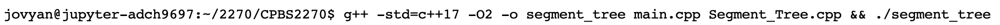

# Creating an object from the Segment Tree class
First, you need to create an object from the SGT class. For this walkthrough, I am calling the object "la_teams". To create this paste the following code into your main.cpp

    SGT la_teams;

In the terminal use run/compile code defined above.

This object represents your Segment Tree and allows you to call its methods for building, querying, and updating the tree. (There will be no output for this line of code)

What your main.cpp should look like:
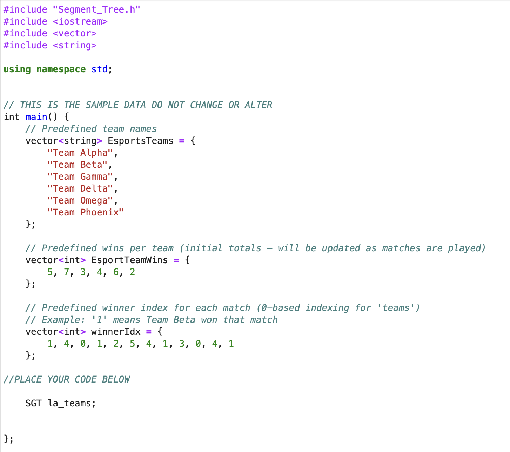

# Building the Segment Tree
To build a Segment Tree from the predefined data in the main.cpp file, place the following code inside main.cpp in the designated area below your existing code:

    la_teams.build(EsportsTeams, winnerIdx);

What your main.cpp should look like:

In the terminal use run/compile code defined above. (There will be no output for this line of code)

Congratulations — you’ve built a tree! Although it is not visually displayed in the console, it exists internally. Here’s what the tree looks like under the hood:

                                                         [0,11]: Team Beta (4)
                                                   /                               \
                               [0,5]: Team Beta (2)                                 [6,11]: Team Beta (2)
                              /                 \                                     /                 \
                 [0,2]: Team Beta (1)   [3,5]: Team Beta (1)   [6,8]: Team Beta (1)   [9,11]: Team Beta (1)
                /            \             /        \           /               \      /                  \
              [0,1]         [2,2]       [3,4]    [5,5]       [6,7]           [8,8]    [9,10]              [11,11]
             /   \           |         /   \        |        /    \             |      /     \               |
           [0,0] [1,1]     [2,2]   [3,3]    [4,4] [5,5]    [6,6]  [7,7]       [8,8]  [9,9]  [10,10]       [11,11]
 
(Note: Some details have been omitted for simplicity. The brackets [ ] indicate the index range of the matches. The team name (e.g., Team Beta) represents the team with the most wins in that range, and the number in parentheses ( ) shows how many wins that team has within the range.)

# Find Maximum Value of the Tree
To find the root node of the Segment Tree (the team with the highest number of wins across all matches), we will use the leader() function. Place the following code in your main.cpp below your other code that you have added:

    cout << "Best team overall: " << la_teams.leader() << endl;

What your main.cpp should look like:
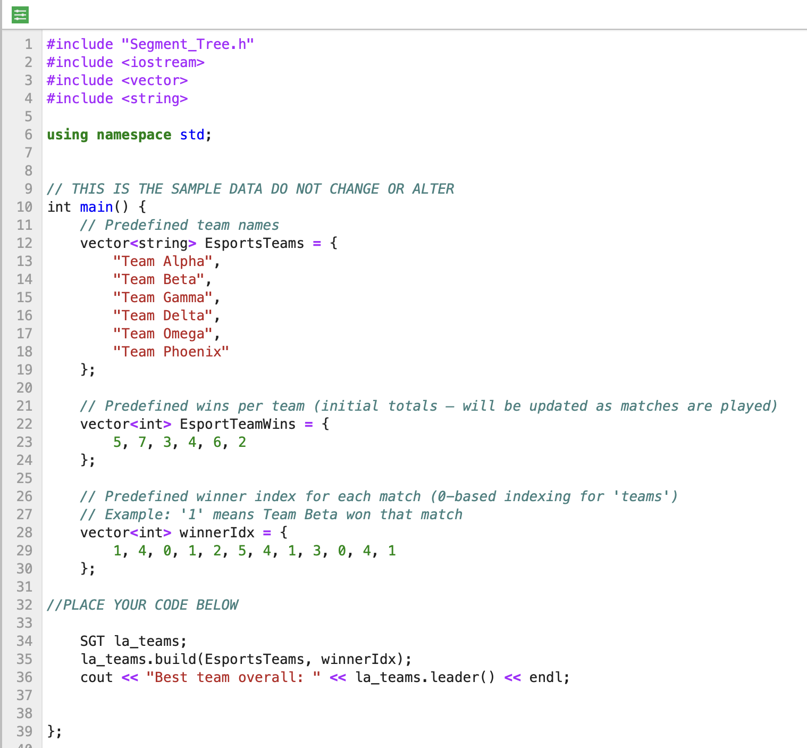

In the terminal use run/compile code defined above.

In the terminal the output should be: 
    Best team overall: Team Beta

# Query
To search for which team had the highest number of wins for a given range of matches, we will use the queryMatchRange() function. This function searches from a internval of matches that you are interested in and find the the team name with the highest amount of wins in that given range and how many wins that team has overall (in the entire data). We can use this function to verify that our leader() function works by pasting the code below into our main.cpp (without the comments):

    la_teams.queryMatchRange(1, int(winnerIdx.size())); //Searching from match 1 to the maximum number of matches.

(**Note** if we were to run/compile this code, there would be no output)

To extract the data points from query and see it visually, create a object from the RangeBest struct. In this example I have called it result.

    RangeBest result = la_teams.queryMatchRange(1, winnerIdx.size());   //This line creates a RangeBest object named result by calling the queryMatchRange function on the 
                                                                        //la_teams node.

The RangeBest struct has 3 data points in it.
RangeBest
- team
- winsInRange
- totalWinsOverall

To access the individual sections we use must call the result.team, result.winsInRange, and/or result.totalWinsOverall to obtain the information. Copy the code below to access each data point in the specific formnat.
    
    cout << "Best team: " << result.team << " (" << result.winsInRange << " wins in range, " << result.totalWinsOverall << " total wins overall)" << endl; //print statement for each component of the RangeBest struct

What your main.cpp should look like:
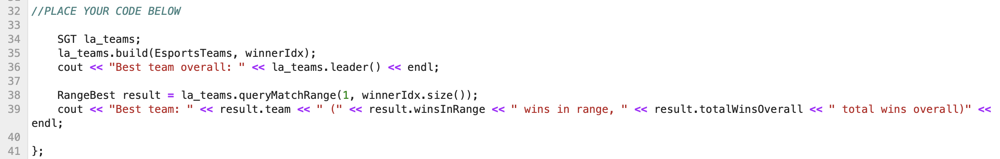

In the terminal use run/compile code defined above.

In the terminal the output should be:
    Best team overall: Team Beta
    Best team: Team Beta (4 wins in range, 4 total wins overall)
    
(**OPTIONAL** If you only wanted to access the specific part of the results such as just the team, how many wins in that range, or how many wins they have in total we can use the following codes) 

    cout << result.team << endl;
    
    cout << result.winsInRange << endl;
    
    cout << result.totalWinsOverall << endl;
    

**Example 1** If I want to look best team and their statistics at match 1 to 5, I would put the following code into my main.cpp

    RangeBest best1_5 = la_teams.queryMatchRange(1,5);
    cout << "Best team: " << best1_5.team << " (" << best1_5.winsInRange << " wins in range, " << best1_5.totalWinsOverall << " total wins overall)" << endl;

What your main.cpp should look like:
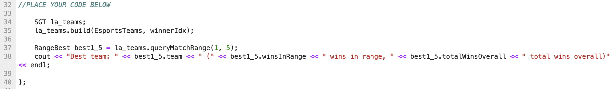

In the terminal use run/compile code defined above.

In the terminal the output should be:
    Best team: Team Beta (2 wins in range, 4 total wins overall)

**Example 2** If I want to look best team and their statistics at match 9 to 4, I would put the following code into my main.cpp
**(The function will automatically switch the positions of the values if the first value is higher!)**

    RangeBest best9_4 = la_teams.queryMatchRange(9, 4); - OR - RangeBest best9_4 = la_teams.queryMatchRange(4, 9);
    cout << "Best team: " << best9_4.team << " (" << best9_4.winsInRange << " wins in range, " << best9_4.totalWinsOverall << " total wins overall)" << endl;

What your main.cpp should look like:
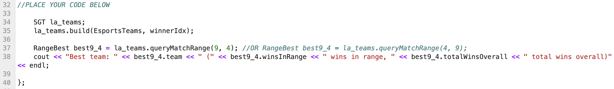

In the terminal use run/compile code defined above.

In the terminal the output should be:
    Best team: Team Beta (2 wins in range, 4 total wins overall)

**Sanity Check**
As you can see, it’s the same answer!
                                      |              |    
    vector<int> winnerIdx = {1, 4, 0, 1, 2, 5, 4, 1, 3, 0, 4, 1};

1 correspesonds to Team Beta and Team Beta appears the most inbetween the brackets.

# Remove a Team / Add a Team
What if a team joins late after finishing their paperwork? We can use the addTeam() function. Code to remove Team Alpha:

    la_teams.removeTeam("Team Alpha");

What your main.cpp should look like:
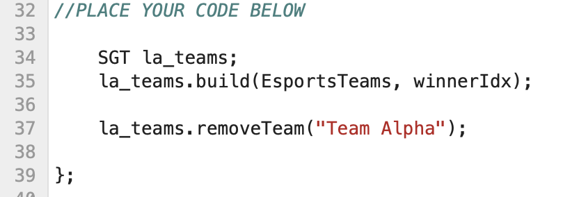

In the terminal use run/compile code defined above.
This will display a message confirming that the team was successfully removed. In the terminal the output should be:

    Removed team: Team Alpha

What if a team gets disqualified and is no longer part of the game? We can use the removeTeam() function. Code to add Team Zeta

    la_teams.addTeam("Team Zeta", 0);
    
**Note** 0 is added because they joined the league and currently have no wins. 

What your main.cpp should look like:
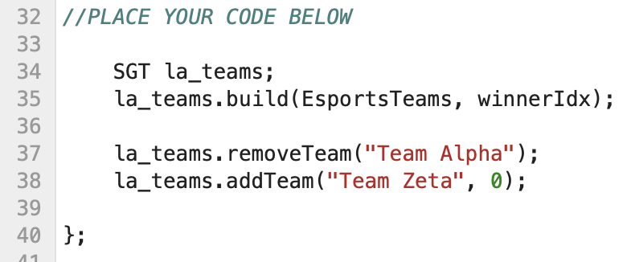

In the terminal use run/compile code defined above.
This will display a message confirming that the team was successfully added. In the terminal the output should be:

    Removed team: Team Alpha
    Added team: Team Zeta
       
**To see the current state of the vectors, run the following code:**
To look up the current team roster we can use the printState() function. Place this code in your main.cpp file.

    la_teams.printState();

What your main.cpp should look like:
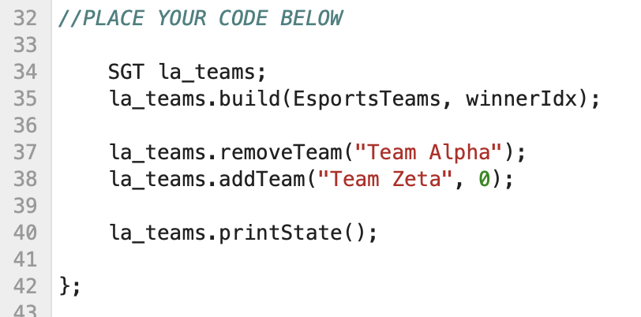

In the terminal use run/compile code defined above.
The roster has successfully removed Team Alpha and added Team Zeta. In the terminal the output should be:
    
    Removed team: Team Alpha
    Added team: Team Zeta
    Teams: Team Beta Team Gamma Team Delta Team Omega Team Phoenix Team Zeta 
    Wins:  4 1 1 3 1 0 
    Idx:   0 3 0 1 4 3 0 2 3 0 

# Add a win
Your team just won a game! Now we can record that win in the Idx vector using their index. For example, if we use the state above with Team Zeta at index 5. First delete the printState() function code and place the code below there. Running the code will increment Team Zeta Wins from 0 to 1 and place their index from the Teams vector into the Idx vector showing who won that match.

Run the following code:

    la_teams.addMatchByName("Team Zeta");
    la_teams.printState();

What your main.cpp should look like:

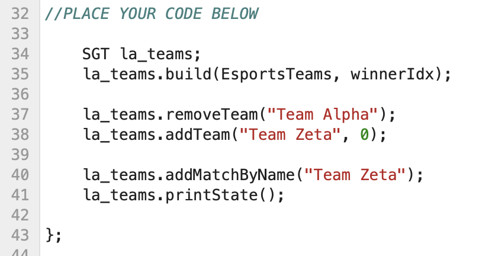

In the terminal use run/compile code defined above.
    
In the terminal the output should be:
    
    Removed team: Team Alpha
    Added team: Team Zeta
    Teams: Team Beta Team Gamma Team Delta Team Omega Team Phoenix Team Zeta 
    Wins:  4 1 1 3 1 1 
    Idx:   0 3 0 1 4 3 0 2 3 0 5 

What if Zeta wins multiple times? We can simply run the addMatchByName() function repeatedly to keep increasing their wins. (Make sure there are 7 total)
    
    la_teams.addMatchByName("Team Zeta");
    la_teams.addMatchByName("Team Zeta");
    la_teams.addMatchByName("Team Zeta");
    la_teams.addMatchByName("Team Zeta");
    la_teams.addMatchByName("Team Zeta");
    la_teams.addMatchByName("Team Zeta");
    la_teams.addMatchByName("Team Zeta");
    la_teams.printState();

What your main.cpp should look like:

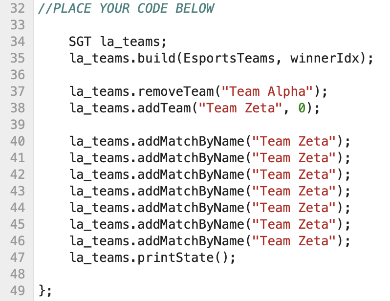

In the terminal use run/compile code defined above.
    
In the terminal the output should be:

    Removed team: Team Alpha
    Added team: Team Zeta
    Teams: Team Beta Team Gamma Team Delta Team Omega Team Phoenix Team Zeta 
    Wins:  4 1 1 3 1 7 
    Idx:   0 3 0 1 4 3 0 2 3 0 5 5 5 5 5 5 5 

**Note** The addMatchByName() function also automatically rebuilds the Segment Tree, so we can query it right away.

If we want to see which team won the most games between match 10 and match 16, we can use the following code below your current code:

    RangeBest best10_16 = la_teams.queryMatchRange(10, 16);
    cout << "Best team: " << best10_16.team << " (" << best10_16.winsInRange << " wins in range, " << best10_16.totalWinsOverall << " total wins overall)" << endl;

What your main.cpp should look like:
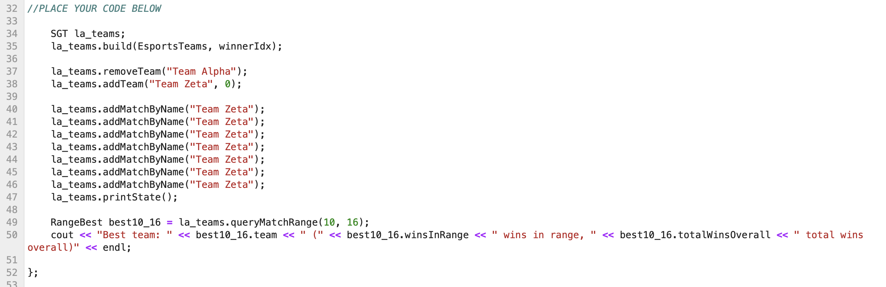

In the terminal use run/compile code defined above.
    
In the terminal the output should be:

    Removed team: Team Alpha
    Added team: Team Zeta
    Teams: Team Beta Team Gamma Team Delta Team Omega Team Phoenix Team Zeta 
    Wins:  4 1 1 3 1 7 
    Idx:   0 3 0 1 4 3 0 2 3 0 5 5 5 5 5 5 5 

Best team: Team Zeta (6 wins in range, 7 total wins overall)
    
# Limitations

- Exact names only. addMatchByName("Team Beta") must match exactly — capitalization and spacing matter. No fuzzy matching.
- Tie rules are simple (and a bit strict). If two teams have the same number of wins in a range, the one that comes first alphabetically is chosen. That’s easy to understand, but maybe not the rule you’d want in real life.
- Rebuilds the whole tree after changes. When you add/remove a team or add a new match, the code “re-makes” the tree from scratch. That keeps things simple and safe, but it’s slower than updating only the affected part.
- Uses more memory as things grow. Every tree node keeps a list of counts for every team. With many teams and many matches, this adds up. It’s fine for class-sized examples, but not great for huge datasets.
- If I had more time: I’d store less data per node (to save memory), update the tree in place (for speed), keep scores, make tie rules configurable, support queries by team or date, add saving to a file, and maybe even build a small GUI.

Most of these limitations came from my focus on getting a working solution first rather than building a fully optimized system. For example, rebuilding the whole tree after every change was the simplest way to guarantee correctness without introducing tricky bugs. I also kept tie rules simple so I could focus on the Segment Tree logic instead of getting lost in edge cases. The exact name matching was just the quickest way to connect match results to teams without needing extra parsing or search logic. In a real-world scenario, I’d revisit each of these to improve speed, memory use, and flexibility.

# Sources

https://www.geeksforgeeks.org/cpp/vector-in-cpp-stl/
https://www.geeksforgeeks.org/cpp/structures-in-cpp/
https://www.geeksforgeeks.org/dsa/segment-tree-data-structure/
https://learn.zybooks.com/zybook/COLORADOCSPB2270Summer2025/chapter/2/section/1 
https://learn.zybooks.com/zybook/COLORADOCSPB2270Summer2025/chapter/7/section/1 
https://en.cppreference.com/w/cpp/language/range-for.html
https://en.cppreference.com/w/cpp/algorithm.html
https://cplusplus.com/reference/ostream/ostream/
https://en.cppreference.com/w/cpp/io/basic_ostream/basic_ostream
